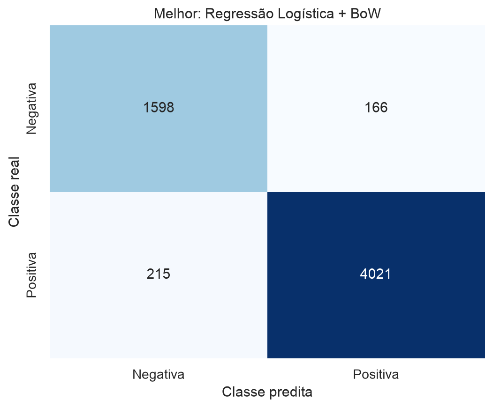

# Relatório técnico — baseline clássico de análise de sentimentos

**Autor:** Henrique Barone  
**Corpus:** B2W-Reviews01  
**Tarefa:** classificação binária de sentimentos em português brasileiro

## 1. Objetivo e protocolo

O estudo comparou duas representações vetoriais clássicas — Bag of Words (BoW) e TF-IDF — com cinco classificadores supervisionados: Multinomial Naive Bayes, Regressão Logística, SVM linear, Random Forest e Gradient Boosting. Não foram usados deep learning, LLMs nem modelos pré-treinados para classificação.

O corpus oficial possui **132.373 avaliações**. A distribuição original das notas é: 27.369 avaliações de 1 estrela (20,68%), 8.389 de 2 (6,34%), 16.315 de 3 (12,33%), 32.345 de 4 (24,43%) e 47.955 de 5 estrelas (36,23%). Portanto, o corpus é desbalanceado em favor das notas altas.

Para formar o problema binário, notas 1–2 foram rotuladas como negativas e 4–5 como positivas; notas 3 foram removidas por representarem neutralidade/ambiguidade. Também foram removidos textos ausentes ou vazios e 2.206 duplicatas exatas antes da divisão, impedindo que o mesmo texto aparecesse em treino e teste. O corpus binário resultante possui **110.882 textos**: 32.601 negativos (29,40%) e 78.281 positivos (70,60%).

A análise descritiva considerou o corpus completo. Os dez experimentos utilizaram uma amostra estratificada e reprodutível de 30.000 textos, decisão necessária para viabilizar os ensembles de árvores em computadores comuns. A divisão foi estratificada em 24.000 exemplos de treino e 6.000 de teste, com semente 42. O conjunto de teste contém 1.764 negativos e 4.236 positivos e não foi usado para ajustar vocabulário, pesos IDF ou hiperparâmetros.

## 2. Pré-processamento e representações

O texto passou por normalização Unicode NFKC, conversão para minúsculas, remoção de HTML, URLs e símbolos, tokenização e lematização em português com spaCy e remoção das stopwords portuguesas do NLTK. Foram preservadas as negações `não`, `nem`, `nunca`, `jamais` e `sem`, pois têm papel semântico decisivo no sentimento. Acentos também foram preservados. O spaCy foi usado exclusivamente no pré-processamento linguístico, não como classificador.

BoW representa cada documento por contagens dos termos; TF-IDF reduz o peso de termos frequentes em muitos documentos e realça termos relativamente discriminativos. As duas representações usaram unigramas e bigramas, `min_df=2` e no máximo 8.000 atributos. Somente o treino foi usado no `fit`; o teste foi apenas transformado.

Os hiperparâmetros foram mantidos próximos aos padrões e alterados apenas por convergência, desbalanceamento, reprodutibilidade ou custo computacional. Regressão Logística e SVM usaram pesos balanceados; Random Forest usou 150 árvores e balanceamento por bootstrap; Gradient Boosting usou 100 estimadores e `max_features='sqrt'`. Para SVM foi escolhido `LinearSVC`, adequado à alta dimensionalidade esparsa de texto.

## 3. Resultados no conjunto de teste

Precisão, revocação e F1 são **macro-médias**, atribuindo a mesma importância às classes negativa e positiva. A tabela está ordenada por F1 macro.

| Representação | Classificador | Acurácia | Precisão macro | Revocação macro | F1 macro |
|---|---|---:|---:|---:|---:|
| BoW | Regressão Logística | **0,9365** | **0,9209** | 0,9276 | **0,9241** |
| TF-IDF | Regressão Logística | 0,9323 | 0,9108 | **0,9331** | 0,9207 |
| TF-IDF | SVM | 0,9332 | 0,9148 | 0,9274 | 0,9207 |
| TF-IDF | Naive Bayes | 0,9298 | 0,9157 | 0,9152 | 0,9154 |
| BoW | Naive Bayes | 0,9277 | 0,9061 | 0,9258 | 0,9150 |
| BoW | SVM | 0,9235 | 0,9071 | 0,9091 | 0,9081 |
| BoW | Random Forest | 0,9100 | 0,8850 | 0,9073 | 0,8948 |
| TF-IDF | Random Forest | 0,9070 | 0,8809 | 0,9062 | 0,8918 |
| BoW | Gradient Boosting | 0,8762 | 0,8912 | 0,8063 | 0,8345 |
| TF-IDF | Gradient Boosting | 0,8755 | 0,8892 | 0,8061 | 0,8339 |

A melhor combinação foi **Regressão Logística + BoW**, com acurácia 0,9365 e F1 macro 0,9241. Isso mostra que as contagens brutas, associadas à regularização do modelo linear, preservaram sinais úteis de intensidade e frequência neste corpus.

Na média dos cinco classificadores, porém, TF-IDF obteve F1 macro 0,8965 contra 0,8953 do BoW: vantagem pequena, de 0,0012. O efeito dependeu do algoritmo. TF-IDF melhorou especialmente o SVM (+0,0126 de F1), foi praticamente neutro no Naive Bayes e Gradient Boosting e reduziu ligeiramente o desempenho de Random Forest e Regressão Logística. Portanto, não existe superioridade universal da representação; a interação entre representação e hipótese do classificador é relevante.

## 4. Matriz de confusão do melhor modelo

| Real \ Predita | Negativa | Positiva |
|---|---:|---:|
| Negativa | 1.598 | 166 |
| Positiva | 215 | 4.021 |

Foram classificados corretamente 1.598 negativos e 4.021 positivos. Houve 166 falsos positivos e 215 falsos negativos. Embora o número absoluto de falsos negativos seja maior, proporcionalmente a taxa de erro foi maior entre avaliações negativas (166/1.764 = 9,41%) do que entre positivas (215/4.236 = 5,08%). Isso confirma a importância de observar métricas macro e matriz de confusão em vez de somente acurácia.

## 5. Análise de erros

O melhor modelo apresentou 381 erros. Para a análise qualitativa, foi examinada uma amostra reprodutível de falsos positivos e falsos negativos. Três padrões se destacaram:

1. **Contraste e avaliações mistas.** Uma avaliação de 2 estrelas elogia “boa qualidade de som” e “botões úteis”, mas depois critica encaixe, estabilidade e bateria. BoW soma pistas positivas e negativas sem modelar bem qual trecho domina a conclusão.
2. **Negação e comparação.** Em uma avaliação de 1 estrela, “a fixação [...] sempre foi muito boa” aparece antes de “não dura 20 minutos”. Os termos positivos do contexto comparativo podem superar a crítica atual.
3. **Nota e texto parcialmente divergentes.** Avaliações de 5 estrelas como “É caro, mas dura muito” e “Qualidade e preço justo. Mas falta a capinha” possuem ressalvas fortes, gerando falsos negativos. Há também textos curtos, erros ortográficos e referências implícitas que as representações esparsas não resolvem.

Esses casos evidenciam limites clássicos de BoW/TF-IDF: pouca representação de ordem longa, composição, alvo do sentimento, ironia e mudança de polaridade dentro do texto. Bigramas ajudam com expressões locais como “não dura”, mas não resolvem integralmente os fenômenos discursivos.

## 6. Limitações

Os resultados correspondem a uma amostra estratificada de 30 mil avaliações e a uma única divisão treino–teste. Portanto, pequenas diferenças entre modelos não devem ser interpretadas como evidência de superioridade estatística. O experimento também não realizou busca de hiperparâmetros, pois o objetivo principal era comparar representações mantendo um baseline clássico e reprodutível.

## 7. Conclusão

O experimento cumpriu o pipeline clássico de NLU e avaliou as dez combinações no mesmo teste isolado. Modelos lineares foram superiores aos ensembles de árvores para os vetores esparsos de alta dimensão. Regressão Logística + BoW é o baseline recomendado para a comparação posterior com sistemas generativos, enquanto TF-IDF + SVM apresentou desempenho quase equivalente e demonstrou que o efeito da ponderação TF-IDF é dependente do classificador.

Os resultados são reproduzíveis a partir do notebook executado, da semente fixa e das dependências versionadas. Os valores completos estão também em [`artifacts/resultados_comparativos.csv`](artifacts/resultados_comparativos.csv), e as dez matrizes em [`artifacts/matrizes_confusao_todas.png`](artifacts/matrizes_confusao_todas.png).

## Referências

- Americanas Tech. **B2W-Reviews01**. Repositório oficial: <https://github.com/americanas-tech/b2w-reviews01>.
- Real, L.; Oshiro, M.; Mafra, A. *B2W-Reviews01: an open product reviews corpus*. STIL, 2019. PDF disponível no repositório oficial.
- scikit-learn. *Feature extraction* e *Supervised learning*: <https://scikit-learn.org/stable/>.
